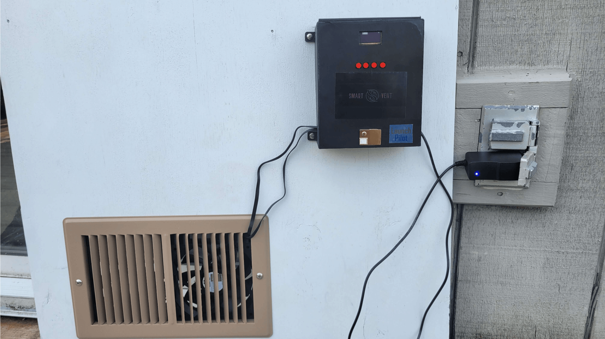
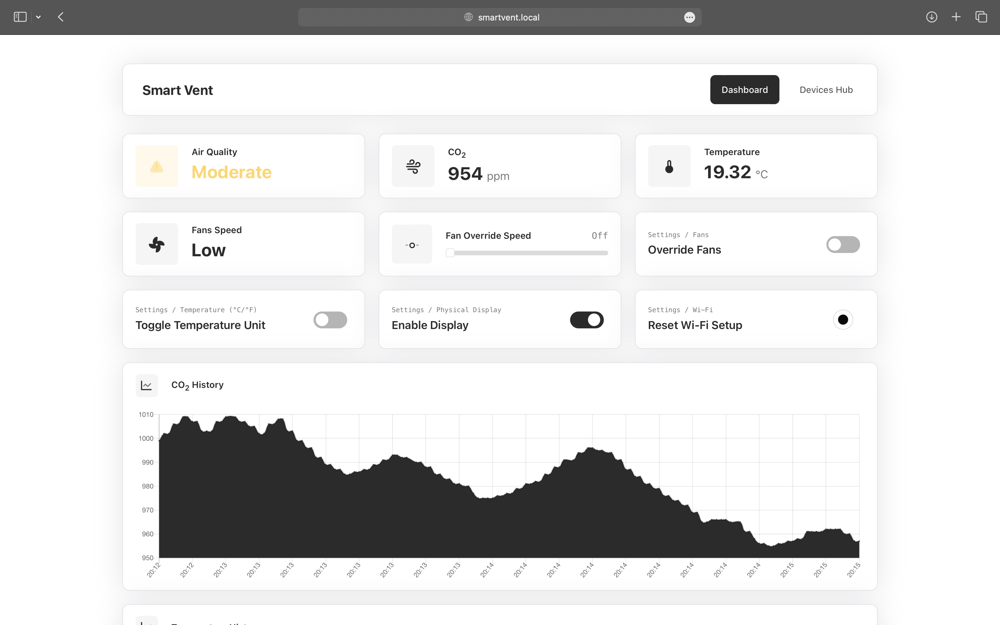
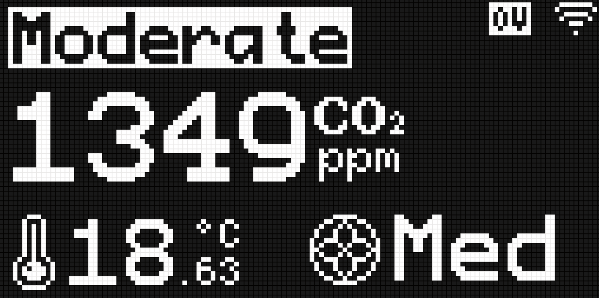

# LaunchPilot: Smart Vent

Senior Capstone Project (Spring 2024)

Industry Sponsor: Cedrec Sumimoto

Faculty Advisor: Andrew Greenberg

Team members: Meshal Almutairi, Michael Fontaine, Abdulaziz Alateeqi,
Fawzan Alfahad, John Michael Mertz

## Overview

We teamed up with Launch Pilot to make a smart vent system. The main goal was to ensure safe indoor air quality by monitoring CO2 levels. When the CO2 level goes above the safe threshold, the system automatically activates to circulate fresh clean air into the room, thus reducing the CO2 level.

## Approach

We designed the system using sensors to detect CO2 levels, temperature, and
humidity. The design also includes fans that operate at different speeds to help with fresh air circulations, an LCD to display the sensor readings, and a microcontroller as the brain of this project. We also implemented a web-based dashboard that is accessible via a local network for remote monitoring and adjustments such as changing the CO2 level threshold, turning the system entirely on or off, and controlling the fan's speed. Additionally, we integrated buttons on the fans to provide direct control for the different settings.

## Results

Our system successfully reads carbon dioxide levels and activates the fans accordingly. Moreover, the web-based dashboard and the buttons work great when adjusting different settings. The LCD provides real-time readings from the sensors as well as any warnings. Users can control the system directly or remotely, which has been a major plus.

## Completed Build

## Dashboard Preview

## Device OLED Display Preview

## Project Report

For more details on the project, please refer to the [Project Report](Documents/Smart_Vent_Report.pdf)

## User Manual

For instructions on how to use the system, please refer to the [User Manual](Documents/Smart_Vent_User_Manual.pdf)

## License

This project is licensed under the AGPL-3.0 License - see the [LICENSE](LICENSE) file for details.

